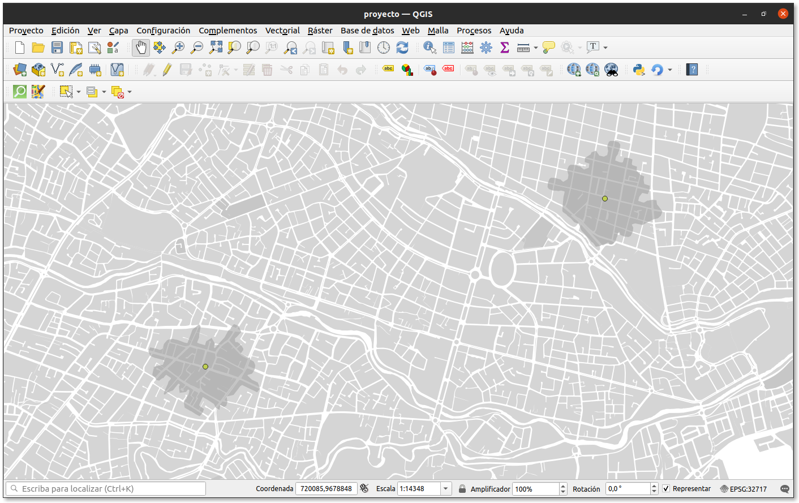
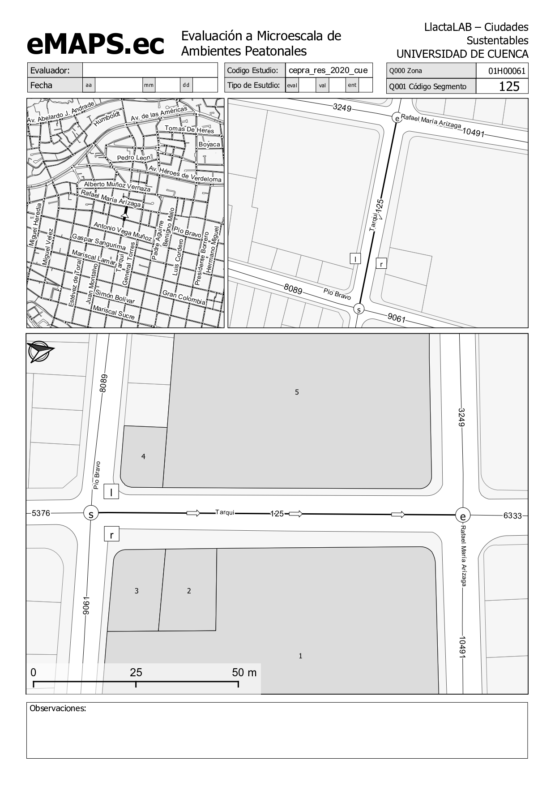

.. _definicion:

Herramienta para la evaluación de la caminabilidad en entornos urbanos

=================================
1 - Definición de Area de Estudio
=================================

Para la aplicación de la herramienta e-MAPS.ec, es necesario previamente definir la zona de estudio 
y los segmentos de calle en donde se llevará a cabo la evaluación. Esta zona se definirá como isócrona 
y estará compuesta de segmentos de calle y sus respectivos lotes, 
a los que se les asignará un código propio; es decir, un código para cada zona, segmento y 
para cada lote del segmento.

En primer lugar se definirá una isócrona a pie alrededor del punto de interés de estudio con
una duración de tiempo determinado por las condiciones y objetivos del estudio.

Definición de Zonas de estudio
------------------------------
Para los ejemplos en ésta documentación hemos tomado una capa de puntos que representan la ubicación
de ingreso a dos escuelas, con QGIS se generó las iscocronas en una capa 
de polígonos que representan las zonas de estudio, y a cada zona se le asigna un código.

En nuestro ejemplo hemos creado el atributo "cod_zona" 

Segmentos de calle
------------------

Los segmentos de calle se representan como unna capa de líneas representando 
los ejes viales de la red de calles de la ciudad. 
La geometría no debe contener líneas doble, debe estar adecuadamente segmentada. Se pueden generalizar y eliminar los segmentos menores a 30m.

Es necesario crear un atributo con la codificación del segmento de calle por ejemplo "cod_segmento"

Los segmentos de calle deben estar dentro de las isocronas (>10% del segmento dentro), es posible que 
en algunos casos sea necesario una revisión manual.

Se debe relacionar los segmentos de calle con la zona de estudio a la que pertenecen mediante 
el atributo que definimos como codificación, en nuestro caso "cod_zona"

Predios o Lotes
---------------
Capa de polígonos representando cada predio de la ciudad. 
Generalmente proviene del catastro oficial de la ciudad. 
En estos predios se evaluarán los usos del suelo, las fachadas, la tipología y mantenimiento de edificaciones, retiros, etc

Se debe relacionar los predios con el segmento con el que serán evaluados 
mediante el atributo que definimos como codificación para los segmentos, en nuestro caso "cod_segmento"

Mapas para levantamiento de campo
---------------------------------

Con la información cartográfica preparada se genera un atlas de trabajo de campo
que consiste en una hoja de trabajo para cada segmento de calle a evaluar 
la hoja de trabajo es una composición mapas y contiene lo siguiente:

   - Cabecera con datos de la zona de estudio y el segmento a evaluar
   - Mapa de la zona de estudio con la identificación del segmento a evaluar
   - Mapa de referencia del segmento de calle a evaluar  
   - Mapa a detalle del segmento de calle a evaluar, identificando el sentido, intersección inicial, intersección final, lado izquierdo, lado derecho, predios a evaluar con la codificación     

En la siguiente imagen se muestra un ejemplo de hoja de trabajo para un segmento de calle:

.. toctree::
   :caption: Contenido
   :glob:
