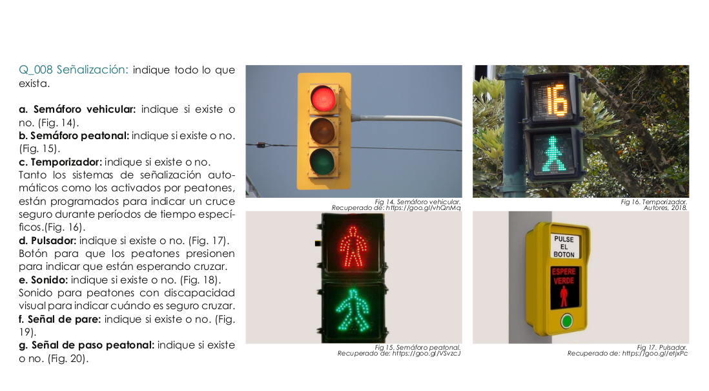

.. _levantamiento:

Herramienta para la evaluación de la caminabilidad en entornos urbanos

================================
2 - Levantamiento de Información
================================

Guía del Evaluador
------------------------------------------
Consiste en un documento tipo manual en el que se explica el procedimiento para la evaluación
en campo, con indicaciones generales, y la guía del protocolo con la definiición de las
preguntas de la encuesta que corresponden a las variables del protocolo eMAPS.ec

Cada pregunta debe estar correctamente codificada, y mantendrá correspondencia con la codificación
de las preguntas cuando implementemos la herramienta de evaluación.

Se puede descargar el la guñia del evaluador en el siguiente link: 

Entrenamiento y Certificación
-----------------------------
Es necesario hacer una capacitación a quienes serán responsables de hacer la evaluación (evaluadores). 
La capacitación es un requisito indispensable puesto que durante la misma, se explican a detalle cada 
ítem del formulario y las posibilidades que se pueden presentar durante la aplicación de la 
herramienta (Ver protocolo - Anexo 1).
La capacitación se compone de clases teóricas y prácticas, y se finaliza con una evaluación. 
Para que un evaluador pueda ser aprobado debe conseguir un puntaje de al menos el 80%, 
caso contrario no podrá realizar el levantamiento. 
La herramienta puede ser aplicada tanto en campo como de manera online 
por medio de Street View, los evaluadores estarán capacitados para aplicar la 
herramienta en ambas versiones al finalizar la capacitación.  

Una vez cumplidos los requisitos previos, se procede a organizar a los evaluadores para realizar el levantamiento de información. Se recomienda hacer la evaluación en días laborables y en un horario entre las 10am y las 5pm, puesto que antes y después de estas horas, los locales comerciales, servicios o equipamientos podrían estar cerrados. Se recomienda también realizar un segundo levantamiento de al menos el 30% de segmentos evaluados, con la finalidad de validar los datos levantados. 

Levantamiento de Información
----------------------------

.. toctree::
   :caption: Contenido
   :glob:
