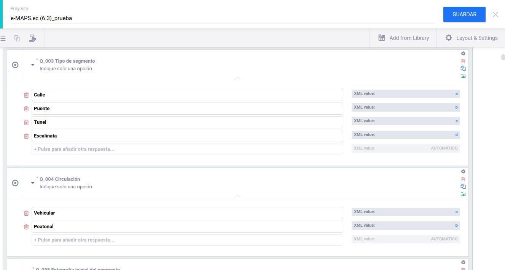

.. _levantamiento:

Herramienta para la evaluación de la caminabilidad en entornos urbanos

================================
2 - Levantamiento de Información
================================

Guía del Evaluador
------------------------------------------
Consiste en un documento tipo manual en el que se explica el procedimiento para la evaluación
en campo, con indicaciones generales, y la guía del protocolo con la definiición de las
preguntas de la encuesta que corresponden a las variables del protocolo eMAPS.ec

.. image:: img/levantamiento/ejemplo1.png
   :width: 600

Cada pregunta debe estar correctamente codificada, y mantendrá correspondencia con la codificación
de las preguntas cuando implementemos la herramienta de evaluación.

Se puede descargar el la guia del evaluador en :download:`Protocolo eMAPS.ec <./_files/protocolo_eMAPS.pdf>`

Entrenamiento y Certificación
-----------------------------
Es necesario hacer una capacitación a quienes serán responsables de hacer la evaluación (evaluadores). 
La capacitación es un requisito indispensable puesto que durante la misma, se explican a detalle cada 
ítem del formulario y las posibilidades que se pueden presentar durante la aplicación de la 
herramienta (Ver protocolo - Anexo 1).
La capacitación se compone de clases teóricas y prácticas, y se finaliza con una evaluación. 
Para que un evaluador pueda ser aprobado debe conseguir un puntaje de al menos el 80%, 
caso contrario no podrá realizar el levantamiento. 
La herramienta puede ser aplicada tanto en campo como de manera online 
por medio de Street View, los evaluadores estarán capacitados para aplicar la 
herramienta en ambas versiones al finalizar la capacitación.  

Una vez cumplidos los requisitos previos, se procede a organizar a los evaluadores para realizar el levantamiento de información. Se recomienda hacer la evaluación en días laborables y en un horario entre las 10am y las 5pm, puesto que antes y después de estas horas, los locales comerciales, servicios o equipamientos podrían estar cerrados. Se recomienda también realizar un segundo levantamiento de al menos el 30% de segmentos evaluados, con la finalidad de validar los datos levantados. 

Herramienta de Evaluación
-------------------------
La herramienta de evaluación consiste en implementar las preguntas del protocole eMAPS.ec
para que los encuestadores realicen la recolección de datos, puede ser realizado de varias formas, utilizando
formularios impresos o herramientas tecnológicas. En el presente documento se reralizó mediante la herramienta
de recolección de datos KoboToolBox, se trata de software libre que permite recoger rápidamente información 
coniable pensada para su uso en crisis humanitaria (http://www.kobotoolbox.org). que tiene tres componentes.

   -  Aplicación para diseño de fomulario
   -  Aplicación para recolección de datos con dispositivos móviles y computador
   -  Agregador y analizador de datos

Se debe tener especial atención en codificar correctamente las preguntas y las posibles respuestas en correspondencia
con el protocolo ya que tiene especial reelevancia en el procedimiento de cálculo.

Levantamiento de Información
----------------------------
Para La recolección de datos:

1. Descargue e instale la aplicación Ko-BoCollect desde la plataforma Play Store para Android o acceder
   al enlace web en iOS.

2. Ingrese a la aplicación.

3. Obtenga el formulario desde el servidor de la encuesta, seleccionando la opción “Obtener formulario en blanco”; acceda con la cuenta de KoboToolbox (proporcionada)

4. Elija el formulario del proyecto de estudio.

.. toctree::
   :caption: Contenido
   :glob:
