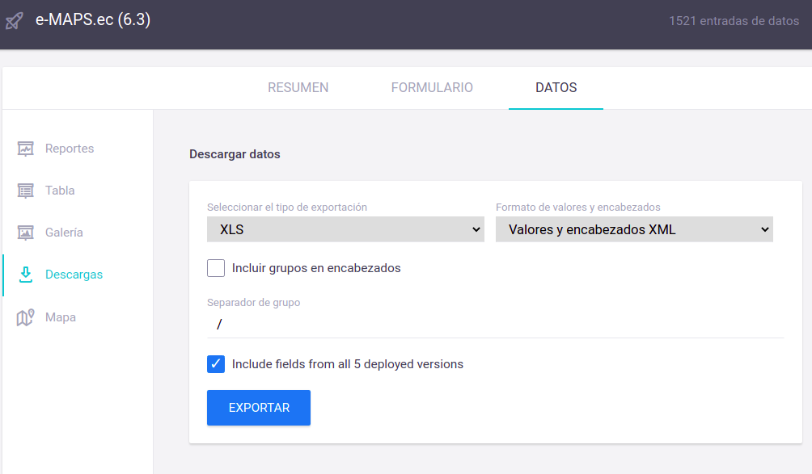
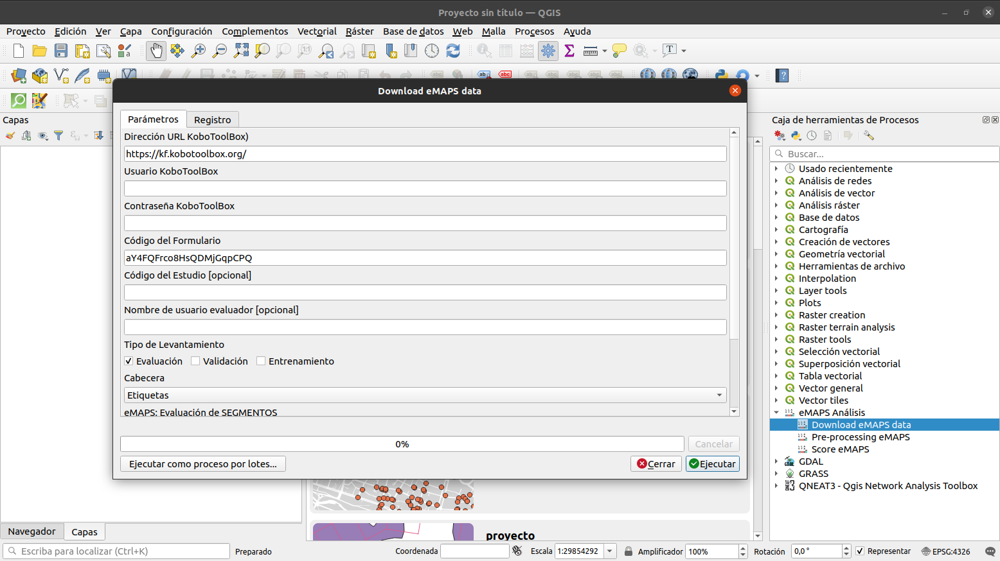
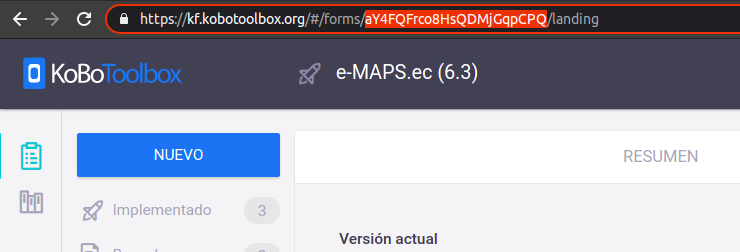

.. _descarga:

=====================================
4 - Descarga de Datos
=====================================

La descarga de los datos levantados depende de la modalidad o herramienta utilizados, que inclusive pueden hacerse manualmente, 
a la final lo que se necesita para el cálculo del score son dos archivos de extensión "CSV" con los datos levantados para
los segmentos de calle y lotes (parcelas), cumpliendo con el requerimiento que el nombre de cada columna tenga
correspondencia con la codificación de las preguntas utilizados en el levantamiento.

Si se utilizó la herramienta de levantamiento KoboToolBox http://www.kobotoolbox.org se puede realizar la descarga 
de dos formas que se explican a continuación:

Exportar desde KoboToolBox
--------------------------

Para exportar los datos levantados desde KoboToolBox es necesario que el usuario tenga los permisos para descargar 
datos del formulario.

En la sección de "DATOS->DESCARGAR DATOS" elegimos el tipo de exportación "XLS" y el formato de valores y encabezados
"Valores y encabezados XML" y presionamos el botón "EXPORTAR"

En el archivo "XLS" tenemos dos hojas de cálculo, que corresponden a los datos levantdos para cada segmento y para cada lote, es necesario crear un archivo de textto delimitado por comas "CSV"
para cada una,  ésto lo podemos hacer desde Libre Office Cal, Microsoft Excel o cualquier editor de hojas de cálculo, éstos 
archivos serán los que se utilizarán en el cálculo de score eMAPS.

Descargar con el plugin para QGIS eMAPS.ec
------------------------------------------

La manera mas sencilla de descargar los datos desde KoboToolBox es mediante el plugin eMAPS para el software libre de Información
Geográfica QGIS https://www.qgis.org

Si todavía no tiene instalado el plugin eMAPS puede descargarlo desde https://github.com/llactalab/eMaps_Score_QGis_Plugin hacer clic en "Download ZIP"

.. image:: img/descarga/git.png
   :width: 600

y cargarlo en la sección de complementos de QGis desde el menú "Complementos -> Ver y Administrar Complementos -> Instala a partir de ZIP":

.. image:: img/descarga/qgis.png
   :width: 600

Una vez instalado el plugin eMAPS en QGIS podemos encontrar los procesos en el ToolBox o Caja de Herramientas, para
la descacrga de los datos seleccionamos dentro de "eMAPS Análisis" el proceso "Download eMAPS data"  

En el formulario de "Download eMAPS data" debemos llenar los siguientes datos:

* **URL KoboToolBox.-** por defecto apunta al servidores de KoboToolBox (https://kf.kobotoolbox.org/) cambiar si se tiene una propia instancia de Kobo.
* **Usuario KoboToolBox.-** nombre de usuario en la plataforma KoboToolBox
* **Contraseña KoboToolBox.-** password de usuario en la plataforma KoboToolBox
* **Código de formulario KoboToolBox.-** código del formulario KoboToolBox del que se va a descargar los datos, puede encontrar el código de formulario obserbando la URL en la aplicación KoboToolBox ej:

* **Código de estudio.-** cuando se utiliza el formulario Kobo para varios estudios, una de las preguntas en la encuesta solicita el código de estudio,  si se especifica se descargará los datos solo para ese código de estudio, caso contrario se descargarán todos los datos levantados.
* **Nombre de usuario evaluador.-** en el formulario Kobo hay una pregunta para identificar al usuario que realiza la evaluación, si está especificado se descargará solo los datos de ése usuario.
* **Tipo de Levantamiento.-** en el formulario Kobo se especifica en una pregunta el tipo de levantamiento, se puede seleccionar los que se desee descargar,  las opciones pueden ser:

   * Evaluación
   * Validación
   * Entrenamiento

* **Cabecera.-** especifica la forma en la que se descargarán las cabeceras de los archivos CSV las opciones son:

   * Etiquetas:  los nombres de columnas contendrán los códigos de pregunta y la etiqueta
   * Códigos de pregunta.- los nombres de columnas contendrán únicamente los códigos de las preguntas

Al ajecutar el proceso, se descargarán los datos desde el servidor de KoboToolBox especificado y se añadiran las capas "eMAPS Segments Evaluation" y 
"eMAPS Parcels Evaluation" al proyecto QGIS en formato vectorial como capa de puntos, si se desea se puede exportar éstas capas a cualquier
formato vectorial soportado por QGIS. 

.. toctree::
   :caption: Contenido
   :glob:
