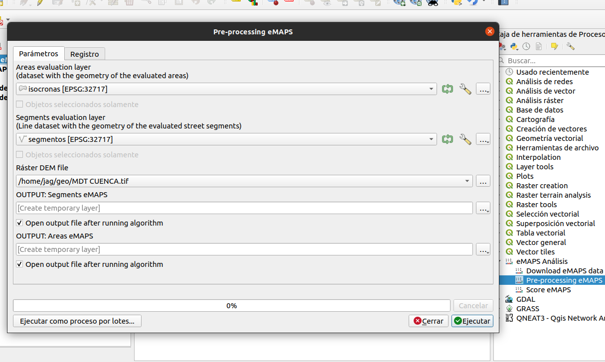

.. _preproceso:

=====================================
5 - Pre procesamiento
=====================================

El algoritmo de pre-procesamiento es parte del Plugin eMAPS para QGIS y es un paso opcional que permite para las capas vectoriales de segmentos
de calle y área de estudio realizar una validación de las geometrías y calcular las columnas:

* ``emaps_len`` calcula la longitud en metros del segmento de calle
* ``emaps_slo`` calcula el porcentaje de pendiente del segmento de calle

Plugin eMAPS para QGIS
----------------------
Si todavía no tiene instalado el plugin eMAPS puede descargarlo desde https://github.com/llactalab/eMaps_Score_QGis_Plugin hacer clic en "Download ZIP"

.. image:: img/descarga/git.png
   :width: 600

y cargarlo en la sección de complementos de QGis desde el menú "Complementos -> Ver y Administrar Complementos -> Instala a partir de ZIP":

.. image:: img/descarga/qgis.png
   :width: 600

Una vez instalado el plugin eMAPS en QGIS podemos encontrar los procesos en el ToolBox o Caja de Herramientas, para
la descacrga de los datos seleccionamos dentro de "eMAPS Análisis" el proceso "Pre-processing eMAPS"  

Pre-Procesamiento
-----------------

Para ejecutar el algoritmo de pre-procesamiento es necesario proporcionar las siguientes entradas:

* "Capa de Area de estudio" seleccionar la capa vectorial de tipo "punto o línea" con el área de estudio a evaluar
* "Capa de Segmentos de Calle" seleccionar la capa vectorial de tipo "línea" con los segmentos de calle a evaluar
* "Ráster DEM File" archivo ráster con el modelo digital de elevaciones con el que se calcularán las pendientes para cada segmento de calle.

Salidas:

* "Capa de Area de estudio" capa vectorial del área de estudio validada
* "Capa de Segmentos de Calle" capa vectorial con los segmentos de calle validada y con las columnas calculadas ``emaps_len`` y ``emaps_slo``

**NOTA: Es importante que las capas de "Area de Estudio" y "Segmentos de calle" estén relacionadas mediante una 
correcta codificación, ésto quiere decir que cada área de estudio deberá tener un código único, y cada segmento de calle
debe tener el código de área al que pertenece,  y cada segmento de calle debe tener un código que lo identifique y sea único y 
es el código que los evaluadores harán referencia cuando realicen el levantamiento**

.. toctree::
   :caption: Contenido
   :glob:
