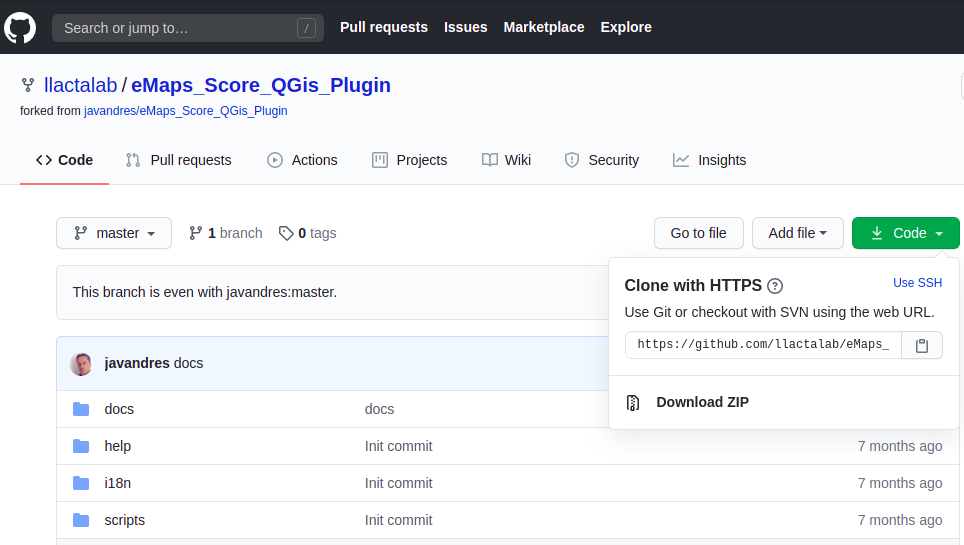
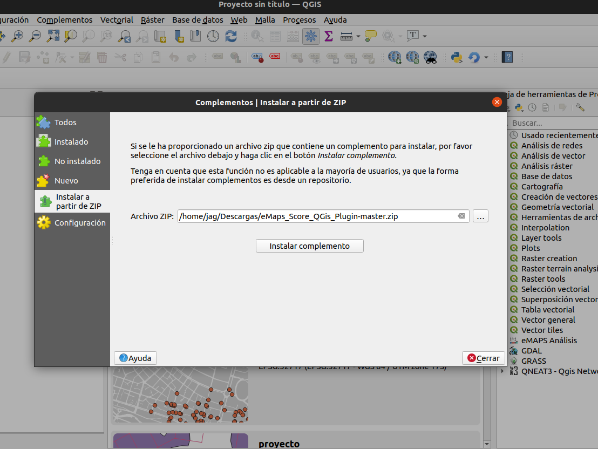
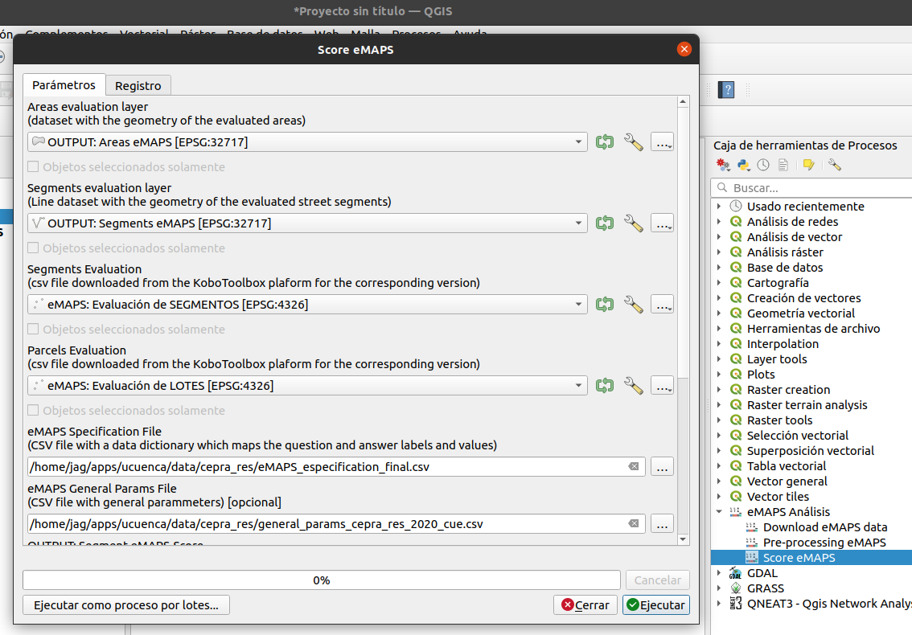
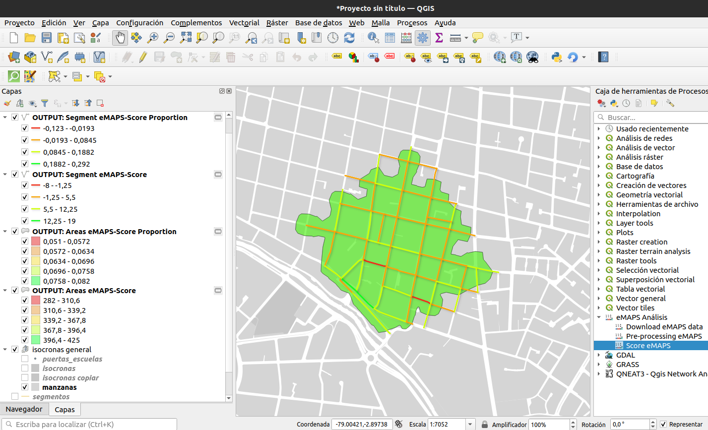

.. _score:

=====================================
6 - Calcular eMAPS Score
=====================================

El algoritmo de ćalculo de score de caminabilidad es parte del Plugin eMAPS para QGIS para la evaluación a micro escala de ambientes peatonales.

.. _install:

Plugin eMAPS para QGIS
----------------------
Si todavía no tiene instalado el plugin eMAPS puede descargarlo desde https://github.com/llactalab/eMaps_Score_QGis_Plugin hacer clic en "Download ZIP"

y cargarlo en la sección de complementos de QGis desde el menú "Complementos -> Ver y Administrar Complementos -> Instala a partir de ZIP":

Una vez instalado el plugin eMAPS en QGIS podemos encontrar los procesos en el ToolBox o Caja de Herramientas, para
el cálculo de eMAPS seleccionaremos dentro de "eMAPS Análisis" el proceso "Score eMAPS"  

Prerequisitos
-------------

Para ejecutar el proceso de cálculo de eMAPS.ec se deben tener las siguientes entradas:

1. **Capa vectorial de "Area de Estudio"** *correctamente codiicada (código de area)*
2. **Capa vectorial de "Segmentos de Calle"** *correctamente codiicada (código de are + código de segmento), con atributos para longitud del segmento y porcentaje de pendiente* ver :ref:`preproceso`
3. **Tabla de "Evaluación de Segmentos de Calle"** *tabla con las evaluaciones de cada segmento de calle* ver :ref:`descarga`
4. **Tabla de "Evaluación de Lotes"** *tabla con las evaluaciones de cada parcela o lote* ver :ref:`descarga`
5. **Archivo CSV "Especificación de variables eMAPS"** *tabla con las evaluaciones de cada parcela o lote* ver :ref:`especificacion`
6. **Archivo CSV "Parámetros Generales eMAPS"** *tabla con parámetros generales de configuración para el procesamiento* ver ver :ref:`general_params`

.. _general_params:

Definición de Parámetros Generales
----------------------------------

El archivo de parámetros generales, es un alista de parámetros en un archivo de texto separado por comas "CSV" 
en el que definimos algunos nombre de columnas que el algoritmo necesita conocer de ante mano para realizar el 
cálculo, y deben corresponder a la codificación de las preguntas en el formulario Kobo, en la siguiente tabla podemos ver un ejemplo de éste archivo, cada parámetro con su comentario:

.. csv-table:: Parámetros Generales
   :file: _files/general_params.csv
   :header-rows: 0
   :class: longtable
   :widths: 1 1 1

Cálculo Score eMAPS.ec
----------------------

Una vez tenemos prpeparadas las capas de entrada, en la ventana del procesamiento elegir las capas de entrada de acuerdo a lo descrito anteriormente
como se muestra en la siguiente imagen:

Una vez finalizado el procesamiento, se generan las capas de salida con el resultado del score:

Las capas resultados del análisis son:

* **Segment eMAPS Score** capa de score por cada segmentos de calle, con atributos para el score alcanzado y el score de referencia,  y atributos con score alcanzado y score de referencia para cada escala y subescala.
* **Parcels eMAPS Score** capa de score por cada area de estudio, con atributos para el score alcanzado y el score de referencia,  y atributos con score alcanzado y score de referencia para cada escala y subescala.
* **Segment eMAPS Score - Proportion** capa de score por cada segmentos de calle, con la proporción del score alcanzado sobre el score de referencia.
* **Parcels eMAPS Score - Proportion** capa de score por cada área de estudio, con la proporción del score alcanzado sobre el score de referencia.

.. toctree::
   :caption: Contenido
   :glob:
