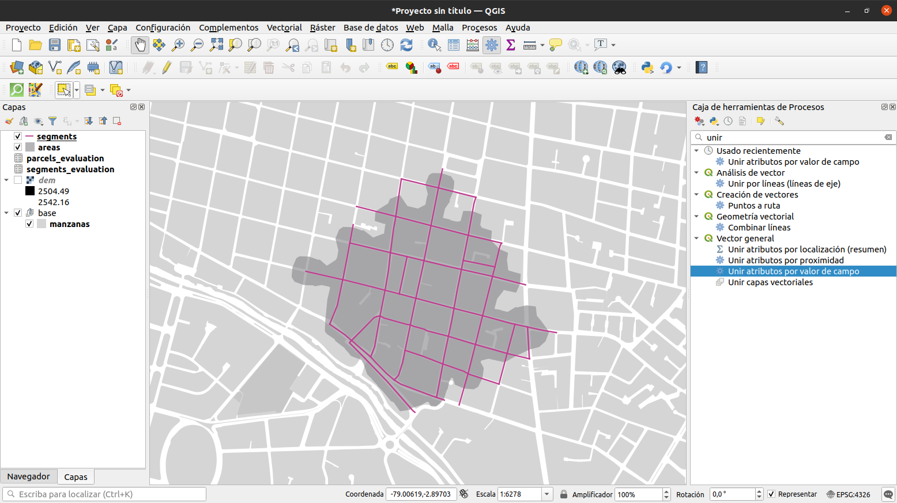
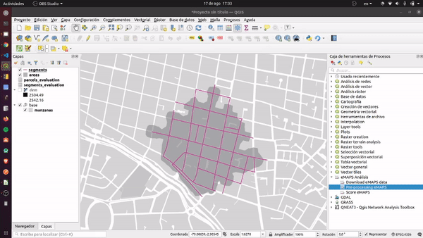
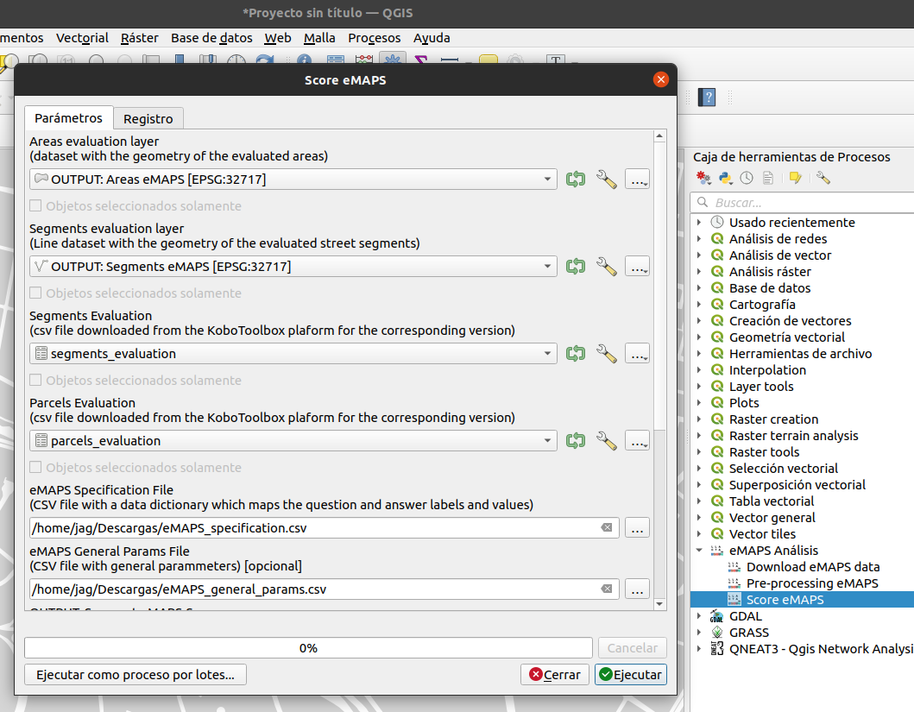
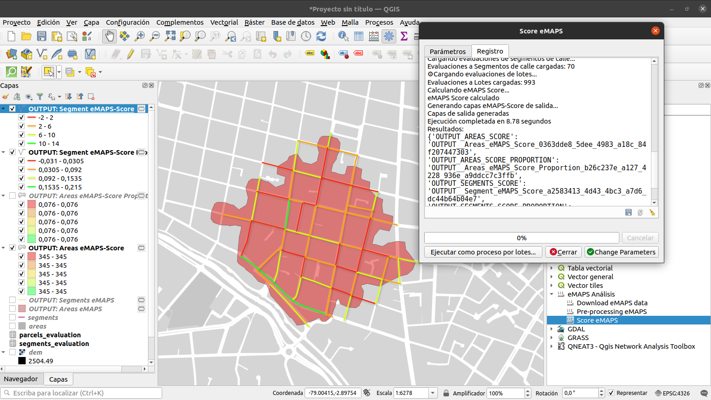
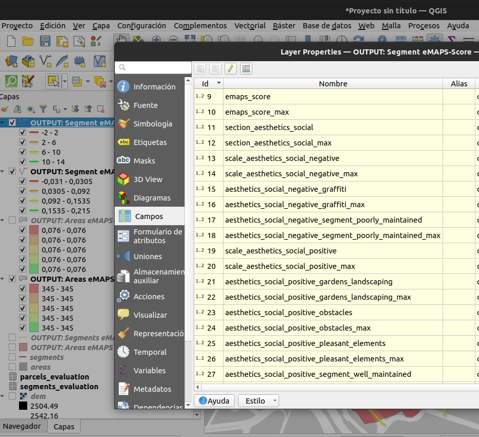
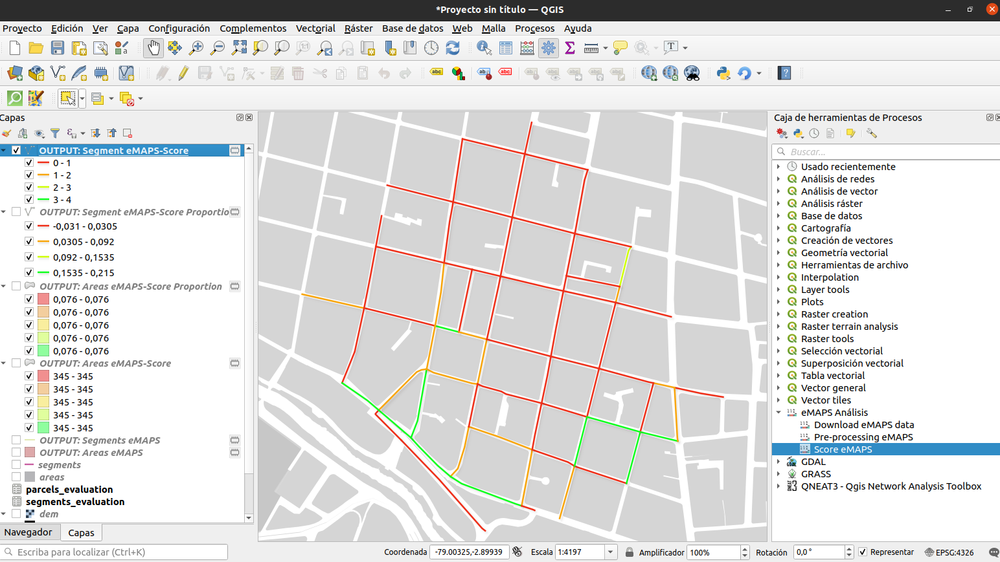

.. _tutorial:

=====================================
TURORIAL eMAPS
=====================================

Ahora vamos a poder en práctica la herramienta, en éste tutorial vamos a callcular el score de caminabilidad eMAPS.ec
para una escuela, caso de estudio en la ciudad de Cuenca, Ecuador.

**Requisitos:**

* Tener una instalacin de QGIS https://www.qgis.org
* Haber instalado el plugin eMAPS.ec en QGIS ver :ref:`install`
* Descargar los siguientes archivos:

   * Capa ráster con Modoelo Digital de Elevaciones para área de estudio :download:`Descargar <./tutorial/dem.tif>`
   * Capa vectorial de area de estudio :download:`Descargar <./tutorial/areas.gpkg>`
   * Capa vectorial de segmentos de calle :download:`Descargar <./tutorial/segments.gpkg>`
   * Datos de levantamiento de esegmentos de calle :download:`Descargar <./tutorial/segments_evaluation.csv>`
   * Datos de levantamiento de lotes :download:`Descargar <./tutorial/parcels_evaluation.csv>`
   * Archivo CSV de especificación de variables eMAPS.ec :download:`Descargar <./tutorial/eMAPS_specification.csv>`
   * Archivo CSV de parámetros generales :download:`Descargar <./tutorial/eMAPS_general_params.csv>`

En éste ejemplo ya hemos definido el área de estudio, realizado el levantamiento de información en campo y contamos con la información levantada en campo descargada desde la herramienta KoboToolBox mediante el plugin eMAPS.ec, 
por lo que vamos a realizar únicamente el pre-procesamiento y el cálculo del score.

QGIS
----

Como paso inicial cargamos las capas descargadas a QGIS

Pre Procesamiento
-----------------

El algoritmo de pre-procesamiento es parte del Plugin eMAPS para QGIS y es un paso opcional que permite para las capas vectoriales de segmentos
de calle y área de estudio realizar una validación de las geometrías y calcular las columnas:

* ``emaps_len`` calcula la longitud en metros del segmento de calle
* ``emaps_slo`` calcula el porcentaje de pendiente del segmento de calle

Para ejecutar el algoritmo de pre-procesamiento es necesario proporcionar las siguientes entradas:

* Seleccionarl la Capa de Area de estudio ``areas.gpkg``
* Seleccionarl la Capa de Segmentos de calle que vamos a evaluar ``segments.gpkg``
* Seleccionar en"Ráster DEM File" el archivo ráster con el modelo digital de elevaciones ``dem.gif``.

Como resultado obtenemos las capas de ``OUTPUT: Areas eMAPS`` y ``OUTPUT: Segments eMAPS`` validadas y con los atributos 
de pendiente y longitud que el algorimo utilizará en el cálculo.

Cálculo de Score eMAPS.ec
-------------------------

En la caja de herramientas dentro de "eMAPS Análisis" seleccionamos el proceso "Score eMAPS" y seleccionamos
nuestras capas de entrada con los archivos que nos descargamos y con las salidas del pre-procesamiento:

Ejecutado el proceso se cargan en QGIS las capas de salida con su simbología y las tablas de atributo con el score de caminabilidad eMAPS.ec 
para cada segmento evaluado y para el área de estudio:

Por defecto las simbología se aplica al score total calculado por segmento, pero podríamos mediante el 
editor de estilos de qGIS seleccionar cualquier escala, sub escala o variable para la visualización por ejemplo la variable ``intersections_positive_ramps`` 
de la escala "intersections" y sub escala "intersections_positive":

.. toctree::
   :caption: tutorial
   :glob:
